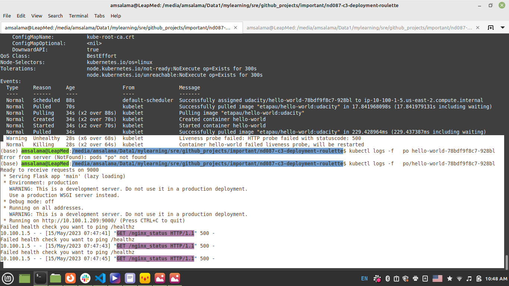
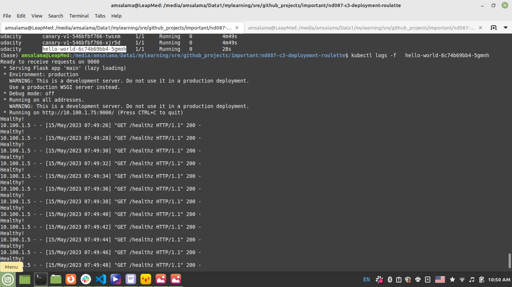

# Hello world

1. Hello world was failed. 
```bash
 kubectl describe  po hello-world-78bdf9f8c7-928bl
  Warning  Unhealthy  28s (x6 over 68s)  kubelet            Liveness probe failed: HTTP probe failed with statuscode: 500
  Normal   Killing    28s (x2 over 64s)  kubelet            Container hello-world failed liveness probe, will be restarted
```

2. Checked logs for hello world service. Had this message displayed )
```bash
Failed health check you want to ping /healthz
10.100.1.5 - - [15/May/2023 07:48:59] "GET /nginx_status HTTP/1.1" 500 -
```


3. Replaced /nginx_status to /healthz in livenessProbe for hello world and redeployed
in apps/hello-world/hello.yml
```bash
kubectl apply -f starter/apps/hello-world/hello.yml
```

4. Logs displayed 

