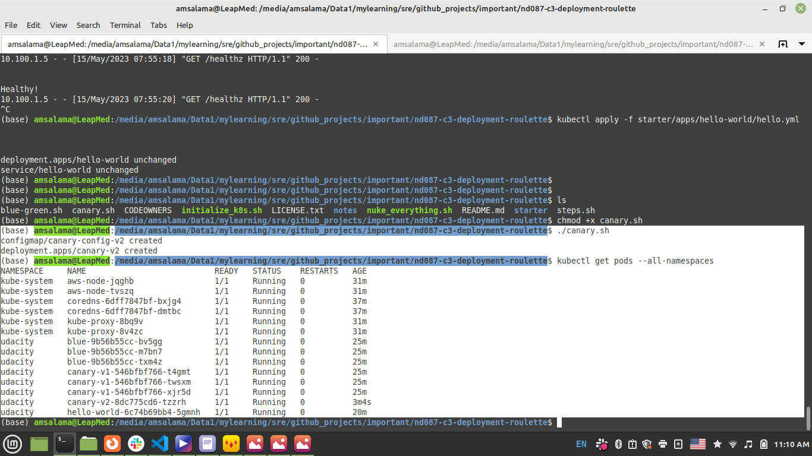
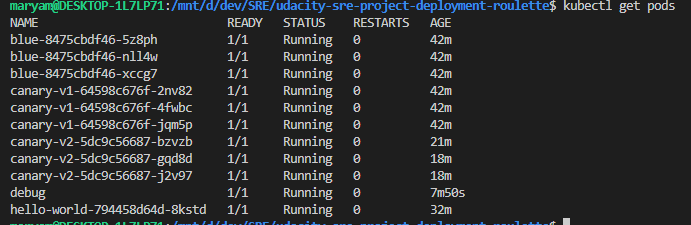

# Canary deployment
After Canary Deployment:

1. Created `canary.sh` script which deploys canary version 2.

2. Service in [repo](../../../starter/apps/canary/canary-svc.yml) targeted only version v1. Needed to remove label selector for version v2, so that all version were targeted.

3. output of `kubectl get pods --all-namespaces`

